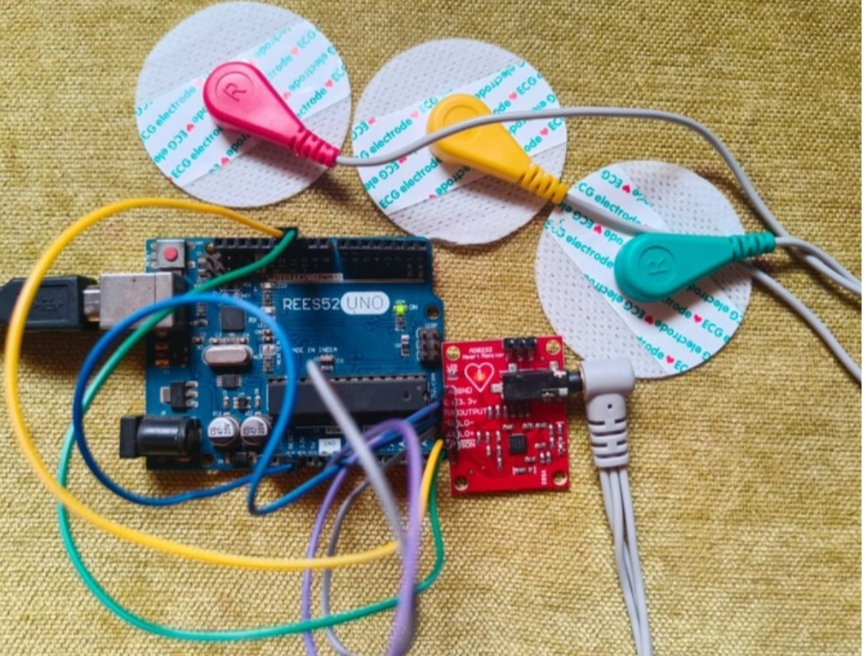
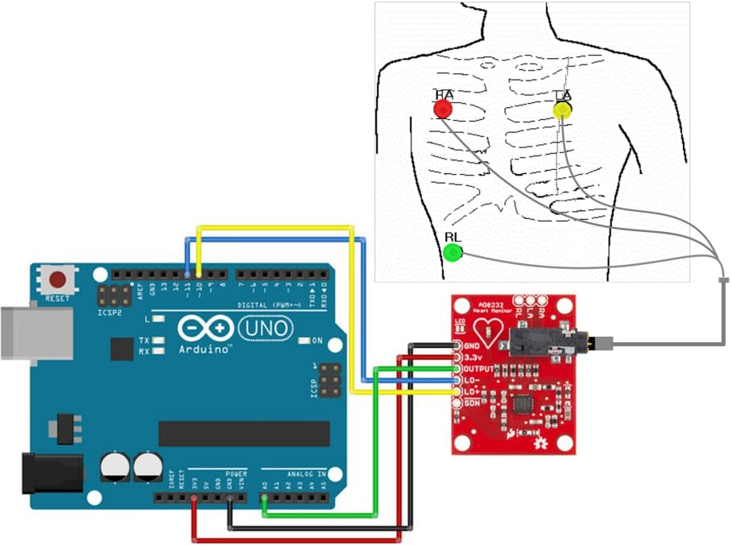
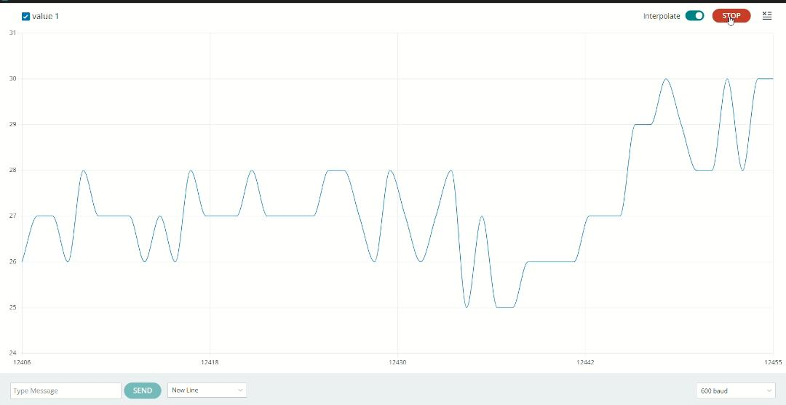
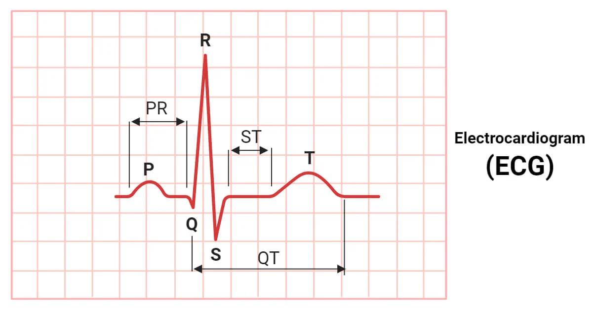

# ECG Heart Monitoring System using Arduino and AD8232

## 📌 Project Overview

This project demonstrates the real-time acquisition and visualization of Electrocardiogram (ECG) signals using the **AD8232 ECG Sensor Module** interfaced with an **Arduino Uno**. The system captures weak electrical impulses generated by the heart, processes them, and displays the ECG waveform using the **Arduino Serial Plotter**.

This project was developed to gain practical experience in biomedical instrumentation, embedded systems, and real-time signal acquisition.

---

## 🎯 Objectives

- To understand the fundamentals of ECG signal acquisition.
- To interface the AD8232 ECG sensor with Arduino Uno.
- To visualize ECG signals in real time using the Arduino Serial Plotter.
- To study signal processing applications using microcontrollers.

---

## 🛠️ Components Used

- Arduino Uno 
- AD8232 ECG Sensor Module
- Jumper Wires
- USB Cable
- Arduino IDE

---

## 🔌 Circuit Connections

| AD8232 Pin | Arduino Uno Pin |
|------------|------------------|
| 3.3V       | 3.3V             |
| GND        | GND              |
| OUTPUT     | A0               |
| LO+        | D10              |
| LO−        | D11              |

---

## 📷 Hardware Setup

*Figure 1: Actual hardware implementation of the ECG monitoring system.*

---

## 🔧 Circuit Diagram

*Figure 2: Circuit diagram showing the interfacing between Arduino Uno and AD8232 ECG sensor module.*

---

## 📽️ Project Demo Video  
Watch the working ECG system here:  
https://drive.google.com/file/d/1QXTfzPo8gEkdVivUgIApS5H1KNG7JOz4/view?usp=drive_link

---

## 💻 Arduino Program

The Arduino code used in this project is available in the repository and is responsible for reading the analog ECG signals from the AD8232 sensor module and transmitting the data to the Arduino Serial Plotter for real-time visualization.

The program also incorporates lead-off detection to identify improper electrode connections, ensuring more reliable signal acquisition.

**Source Code:** `Arduino_code/ECG_Arduino.ino`

---

## ⚙️ Working Principle

The human heart generates electrical impulses during each heartbeat. These signals can be detected non-invasively through electrodes placed on the skin.

The AD8232 ECG sensor module amplifies and filters these weak bioelectrical signals to produce a conditioned analog output. The Arduino Uno continuously reads this output through its analog input pin and transmits the values to the Arduino IDE Serial Plotter, where the ECG waveform is displayed in real time.

---

## 📈 Results

The system successfully acquired and visualized ECG signals in real time using the AD8232 ECG sensor module and Arduino Uno. The waveform displayed on the Arduino Serial Plotter exhibited distinct peaks corresponding to cardiac electrical activity.

### 1. Real-Time ECG Output

*Figure 3: Real-time ECG waveform obtained from the AD8232 sensor using the Arduino Serial Plotter.*

---

### 2. Ideal ECG Reference Waveform

*Figure 4: Standard ECG waveform illustrating the typical P wave, QRS complex, and T wave of a normal cardiac cycle. This image is provided for educational reference and comparison purposes.*

---

### 📌 Observation

The acquired ECG signal closely resembles the standard ECG waveform. Minor noise and variations may occur due to electrode placement and body movement, while the ideal ECG serves as a reference for comparison.

---

## 🔍 Key Learnings

Through this project, practical knowledge was gained in the following areas:

- Biomedical signal acquisition techniques.
- Interfacing sensors with microcontrollers.
- Real-time data visualization using Arduino tools.
- Basic concepts of ECG waveform monitoring.
- Hardware implementation and troubleshooting.

---

## 🚀 Future Enhancements

Potential improvements to this project include:

- Integration of Bluetooth modules for wireless monitoring.
- Development of a mobile application for ECG visualization.
- Implementation of cloud-based data storage for remote access.
- IoT-enabled healthcare monitoring solutions.
- Exploration of machine learning techniques for arrhythmia detection.

---

## ⚠️ Disclaimer

This project has been developed solely for **educational and demonstration purposes**. It is **not intended for medical diagnosis, treatment, or clinical use**. The system should not be considered a substitute for certified medical equipment.

---
## 👩‍💻 Author

**Mampi Das**  
B.Tech in Electrical Engineering  
National Institute of Technology Agartala  

The project was developed as part of academic coursework and has been organized and presented here for learning, documentation, and portfolio purposes.

